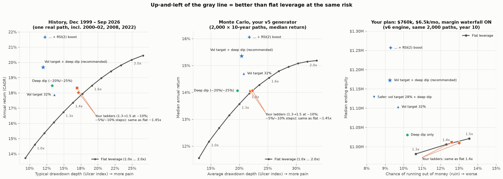

# When should leverage go up or down? (QQQ regime strategy)

**Question:** You run QQQ at 1.3–1.4x through QLD plus QQQ while the 200-day-SMA band regime is ON, and hold SGOV when it is OFF.
Does it add value to raise leverage on corrections? For example, 1.3x → 1.5x at −10%, or steps at −5% and −10%, then de-lever at highs.
Is there anything that beats simply holding a flat 1.3x or 1.4x?

**Method.**
- **Rules tested:** about 600 leverage rules, layered on your exact regime filter.
- **Baseline:** your v5 dashboard's regime, costs and data, reproduced exactly.
- **Fair comparison:** each rule is compared with flat leverage at the same risk (same Ulcer index, i.e. the same typical drawdown depth). Adding leverage always raises the return; the question is whether a rule earns more than flat leverage would at that same risk.
- **The 9 tests:**
  - History, Dec 1999 → Sep 2026: the full period, three separate eras (2000–08, 2009–16, 2017–26), and the full period traded one day late.
  - Monte Carlo, four generators: your v5 generator (post-2005, 21-day blocks), 126-day blocks, a full 1999+ return pool (includes the dot-com crash), and full pool with 126-day blocks.
  - Winners were then run through your full plan: the v6 engine with the margin and outside-debt waterfall.



## Answer

### 1. Adding leverage on −5% / −10% corrections is flat leverage in disguise
| Rule (start at 1.3x) | Value added vs flat, same risk (history / Monte Carlo) | What it really is |
|---|---|---|
| Add at **−5%** | −0.4 to +0.2 %/yr; negative in most tests | Flat 1.45–1.9x. QQQ is often 5% below its high. |
| **1.3 → 1.5 at −10%**, reset at high (your idea) | +0.7 / +0.05 to +0.25 %/yr | Flat ~1.44x. Averages 1.44x and has the same risk. |
| **1.3 → 1.4 at −5% → 1.5 at −10%** | +0.3 / 0.0 to +0.15 %/yr | Flat ~1.45x |
| De-lever at highs (1.0–1.2 at ATH) + ladder | +0.6 / −0.2 to +0.3 %/yr | Not reliable |
| **Add only at −20% / −25%**, off again once it recovers above the trigger | **+2.5 / +0.5 to +0.9 %/yr, wins all 9 tests** | Rarely on (3.5% of invested days) |

In your plan, both ladders land exactly on the flat-1.4x point. The median is about $1.01M, 12.6–13.0% run out of money, and 55% reach the goal.

### 2. Volatility-scaled leverage is what beats flat leverage
Corrections arrive with volatility spikes. The growth-optimal (Kelly) leverage is L\* = (μ − c)/σ², where μ is the expected return, c the cost of leverage and σ the volatility. When σ doubles, σ² quadruples, so a dip would need four times the expected return to justify the same leverage. Within your regime, the data shows no such dip premium, except at deep, capitulation-level drops.

Volatility is highly predictable and returns are not. So leverage should follow volatility, and add on top only at deep dips, where your 15-day exit caps the downside of the extra leverage.

### Recommended rule (v6 default `vol_target_plus_deep_dip`)
While the regime is ON:
```
leverage = clip( 32% / σ , 1.0 , 1.6 )      σ = QQQ daily-return EWMA volatility (10-day half-life), annualised
         + 0.4   while QQQ is ≥ 20% below its 52-week closing high
         + 0.3   more while ≥ 25% below it
         (cap 2.0 = 100% QLD; only rebalance when the target moves ≥ 0.1)
Regime OFF → SGOV, unchanged.
```
- **In practice:** about 1.5–1.6x in calm uptrends (76% of invested days). It drops to about 1.0–1.1x as a selloff's volatility spikes (2018 Q4, Feb–Mar 2020, early 2022, Mar–Apr 2025). The dip kicker adds leverage back only at capitulation depths.
- **Trading:** about 10 leverage changes a year.
- **Today (25 Sep 2026):** volatility is 17.3%, so the target is **1.6x** (the cap).
- **Safer version:** a 28% target gives about 1.4x average and the lowest ruin rate.

| 9-test scorecard (%/yr vs flat at equal risk) | Hist full | 2000–08 | 2009–16 | 2017–26 | 1 day late | MC v5 | MC 126d | MC full | MC full 126d | Won |
|---|---|---|---|---|---|---|---|---|---|---|
| **Recommended** (vol 32% + deep dip) | +4.4 | +1.4 | −0.2 | +3.7 | +2.5 | +1.7 | +2.5 | +1.7 | +2.4 | 8/9 |
| Safer (vol 28% + deep dip) | +4.2 | +1.3 | −1.0 | +4.1 | +2.2 | +1.6 | +2.5 | +1.5 | +2.2 | 8/9 |
| Recommended + RSI(2) boost | +6.3 | +3.5 | +0.6 | +5.2 | +4.4 | +2.1 | +3.0 | +2.7 | +3.7 | 9/9 |
| Deep dip only (on flat 1.3) | +2.5 | +0.8 | +1.0 | +4.1 | +0.8 | +0.6 | +0.9 | +0.5 | +0.7 | 9/9 |
| Vol target 32% only | +1.8 | +0.2 | −1.1 | −0.0 | +1.8 | +1.0 | +1.5 | +1.1 | +1.9 | 7/9 |
| Your ladder 1.3 → 1.5 at −10% | +0.7 | +0.6 | +0.1 | +2.1 | +0.5 | +0.1 | +0.3 | +0.2 | +0.1 | 9/9 |

History, raw figures (Dec 1999 → Sep 2026):

| Strategy | Annual return | Max drawdown |
|---|---|---|
| Flat 1.3x | 16.7% | −46.5% |
| Flat 1.4x | 17.4% | −49.7% |
| Your −10% ladder | 18.3% | −51.4% |
| **Recommended** | **19.7%** | **−42.7%** |

### Your plan
$760k start, $6.5k/mo floor or 0.7%, margin and outside debt ON. v6 engine, 2,000 identical paths, 10 years.

| | Median at yr 10 | 25th pct | Ruin | Below start | Reached $1.5M |
|---|---|---|---|---|---|
| Flat 1.3x | $981k | $367k | 10.7% | 42% | 51% |
| Flat 1.4x | $1,006k | $342k | 12.3% | 42% | 54% |
| Your ladder 1.3 → 1.5 at −10% | $1,012k | $338k | 12.6% | 41% | 55% |
| Deep dip only | $1,031k | $395k | 10.2% | 41% | 53% |
| Vol target 32% | $1,103k | $423k | 9.7% | 38% | 57% |
| **Recommended** | **$1,172k** | **$454k** | **9.3%** | **36%** | **59%** |
| Safer (28%) | $1,129k | $466k | **8.4%** | 37% | 57% |
| Recommended + RSI(2) boost | $1,257k | $455k | 9.3% | 35% | 62% |

**The bigger lever is spending.** A $6.5k/mo floor is about a 10% withdrawal rate. Cutting the floor to $5.5k takes ruin from 10.7% to 5.5% at flat 1.3x, or 4.7% with the recommended rule ($5k: 4.0% / 3.0%). That is a bigger effect than any leverage rule.

## Caveats
- **Tuned on the data it's tested on.** Every rule was picked and tested on the same 27 years of QQQ, which contain only about 20 corrections of 10% or more. The Monte Carlo reshuffles those same days; it is not new data.
- **2009–2016 weakness.** Volatility scaling lagged flat leverage then (sharp V-shaped dips where it cut exposure near the lows). The deep-dip kicker is what keeps the combination roughly even in that era.
- **RSI(2) boost is fragile.** It works at thresholds 3–5 with 3–5 day holds and fails at 2, 7 and 10. Its edge rests on a handful of huge rebound days (for example 2025-04-08 and 2000-01-06). Treat it as optional.
- **Constant rates.** Costs follow your dashboard's constant assumptions: 5.45% on the QLD sleeve, SGOV at 4.2%, 5 bp per unit traded. Price returns only, no dividends.
- **Taxes.** Frequent re-leveraging realises gains in a taxable account. These rules suit an IRA-type account better.
- **Daily-constant leverage.** The model treats leverage as rebalanced every day, like v5. A real QLD/QQQ mix drifts slightly between trades.
- Not financial advice.

## Files
| File | What |
|---|---|
| `QQQ_leveraged_plan_v6.py` | **Your dashboard, v6.** Paste into one Colab cell. Adds `leverage_mode` (recommended default), deep-dip / ladder / RSI(2) options and a `compare_to_static` side-by-side on identical paths. Vectorised: about 9 s for 2,000 paths. With `leverage_mode="static"` and `trade_cost_bps=0` it reproduces v5's results exactly (checked on 3 scenarios, differences 0.0). Falls back to an uploaded QQQ xlsx/csv if yfinance is unavailable. |
| `lev_engine.py`, `policies.py` | Vectorised regime/leverage engine (checked against an independent plain loop to 1e-14) and all rule families |
| `hist_study.py` | Broad historical search, about 450 variants → `results/hist_results.csv` |
| `mc_study.py`, `scorecard.py` | Monte Carlo generators and the 9-test scorecard → `results/scorecard*.csv` |
| `experiments.py` | `ladders`, `oversold`, `anchors` (ATH vs 52-week vs regime-peak drawdown), `final` |
| `summary_chart.py` | Builds `leverage_rules_summary.png` |
| `results/` | All result tables (`ladder_grid.csv` = the drawdown-trigger grid; `v6_modes.csv` = plan outcomes above) |

Run the research with `QQQ_XLSX=<full 1999+ export> python3 scorecard.py`, or `python3 experiments.py final`.

## Playbook: start balance, withdrawal and cruising leverage
`results/plan_grid_start_withdrawal_leverage.csv` holds v6-engine runs for $760k and $900k starts, $3.5k–$6.5k/mo, with and without the 0.7%-of-equity add-on, 9 leverage setups and two return pools. "2005" is your v5 generator. "1999" puts the 2000–02 crash in the pool, so it is the harsher test.

| Setup (recommended rule unless noted) | Ruin, 2005 pool | Ruin, 1999 pool | Median at yr 10 (2005 pool) | Reached $1.5M |
|---|---|---|---|---|
| $760k, $6.5k floor + 0.7%, vol target 28% | 8.4% | 24.1% | $1.13M | 57% |
| $760k, $6.5k floor + 0.7%, vol target 32% | 9.2% | 25.7% | $1.17M | 59% |
| $760k, $6.5k floor + 0.7%, flat 1.3x | 10.6% | 30.2% | $0.98M | 51% |
| $900k, $6.5k floor + 0.7% | 4.7% | 17.2% | $1.52M | 72% |
| $900k, fixed $4,500/mo | 0.6% | 5.8% | $2.47M | 82% |
| **$900k, fixed $4,000/mo** | **0.4%** | **3.6%** | **$2.60M** | **83%** |

Run `daily_signal.py` after each close. It prints the regime, volatility and target leverage (with the QLD/QQQ mix), plus the QQQ prices where the regime-exit and dip rules kick in.

### Build-up: what each change adds
Each step adds one change on top of the previous one. Return and max drawdown are from history, Dec 1999 → Sep 2026, with no withdrawals. The plan columns are $760k at $6.5k + 0.7%, run in the v6 engine on the 2005 pool (ruin in the 1999 pool in brackets).

| Step | Annual return | Added | Max drawdown | Plan median | Plan ruin |
|---|---|---|---|---|---|
| No trend filter, flat 1.3x | 7.4% | | −91.6% | | |
| 0. Regime filter + flat 1.3x (baseline) | 16.7% | +9.3 from the filter | −46.5% | $981k | 10.6% (30.2%) |
| 1. + vol target 32% (1.0–1.6x) | 17.9% | +1.2 | −36.5% | $1.10M | 9.7% (26.2%) |
| 2. + deep-dip add-on (= recommended) | 19.7% | +1.8 | −42.7% | $1.17M | 9.2% (25.7%) |
| 3. + cap 1.8 | 20.2% | +0.5 | −42.7% | $1.21M | 9.8% (26.0%) |
| 4. + cheaper financing (4.6% vs 5.45%) | 20.7% | +0.5 | −42.6% | $1.27M | 9.4% (25.4%) |
| 5. + RSI(2) boost (fragile) | 22.3% | +1.6 | −43.6% | $1.36M | 9.2% (24.8%) |
| 6. + fixed $6.5k (drop the 0.7% add-on) | — | — | — | $1.67M | 9.2% (24.8%) |

Same risk at $900k as $760k at $6.5k: about **$7,700/mo**, i.e. the same ~10.3% withdrawal rate (`results/buildup_and_900k_match.csv`).

### Checking weekly instead of daily
Tested on the volatility-bucket rule (<18% 1.6x, 18–22% 1.4x, 22–26% 1.2x, ≥26% 1.0x, plus the dip add-on). Plan figures are $760k at $6.5k, no margin model.

| When you check | Annual return (history) | Median CAGR (MC, 2005 pool) | Plan ruin, 2005 pool / 1999 pool |
|---|---|---|---|
| Every day | 19.1% | 14.7% | 9.1% / 24.8% |
| Fridays only | 18.1% | 14.3% | 10.5% / 26.1% |
| **Fridays + any day QQQ moves ≥3%** (about 16 extra days a year) | 19.0% | 14.8% | 9.3% / 24.8% |
| Flat 1.3x (for reference) | 16.7% | 13.6% | 11.2% / 31.4% |

The buckets perform the same as the continuous formula (history 19.1% vs 19.2%).

### thinkorswim study
`QQQ_leverage_signal.thinkscript` is the same rule as a thinkorswim lower study. Apply it to a daily QQQ chart with a 20-year or Max time frame. Setting `useVolTable = no` gives the flat-base version (flatLeverage + dip adds).

A line-by-line Python port of the script matches the research engine on every day from 2000 to 2026 (regime and target, 100% agreement). The script itself was not run inside thinkorswim.

### 2005–2026 only (excludes the 2000–02 bust)
History from Jan 2005, with the regime state carried in from before:

| Rule | Annual return | Max drawdown |
|---|---|---|
| Flat 1.0x | 15.8% | −28.6% |
| Flat 1.3x | 18.4% | −36.2% |
| Flat 1.6x | 20.7% | −43.3% |
| Ladder 1.3 → 1.5 at −10% | 20.1% | −39.2% |
| Flat 1.3 + dip adds | 20.1% | −32.8% |
| **Vol table + dip adds** | **20.6%** | **−29.6%** |
| Buy & hold QQQ | 14.2% | −53.7% |

**Rolling 10-year plan windows on the real 2005+ sequence** ($760k, $6.5k floor or 0.7%, no margin model, 141 monthly starts 2005–2016): no rule ran out of money.

| Rule | Median at yr 10 | Worst window end | Lowest balance in the worst window |
|---|---|---|---|
| Flat 1.3x | $2.08M | $590k | $384k |
| Vol table + dip adds | $2.61M | $773k | $379k |

The windows overlap heavily, so they amount to only about two independent decades.

**Dip frequency.** Drops of 20%+ below the 52-week high while the regime was ON: 2000-04, 2008-01, 2018-12, 2020-03, 2022-03, 2025-04. That is about one every 4–5 years. Drops of 25%+ while ON: only 2000-04 and 2020-03.
